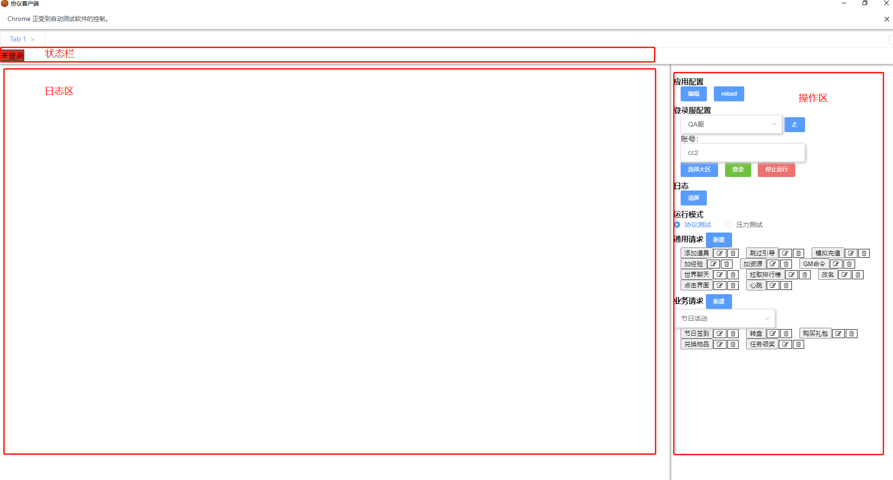
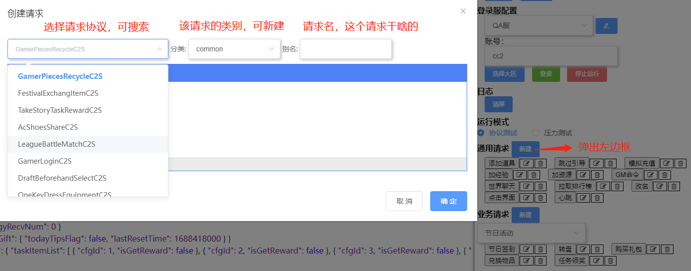
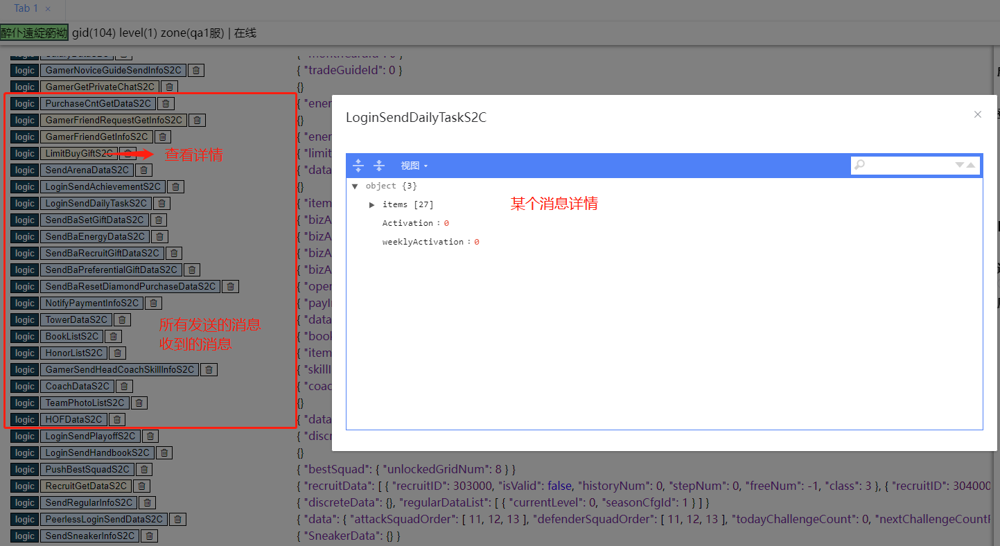
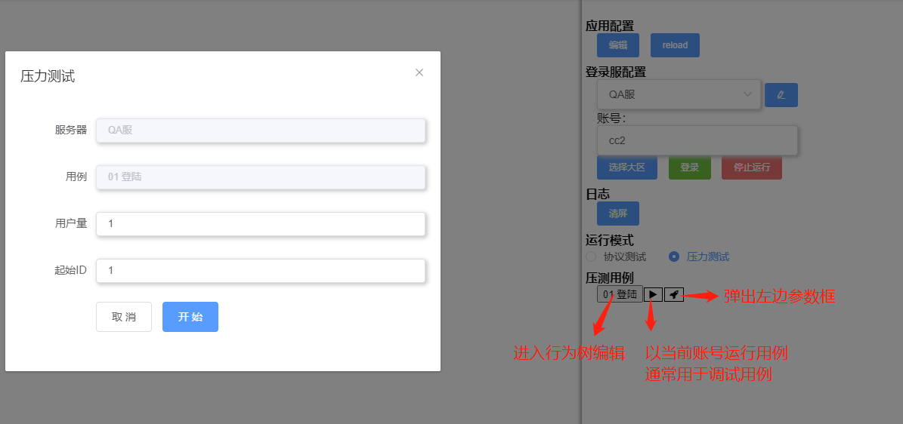
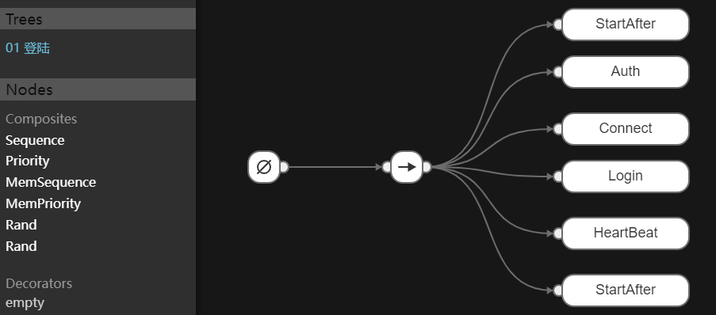
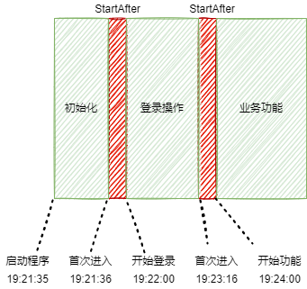

## 使用场景

### 压力测试

- 使用行为树进行控制

  流程控制代码主要由行为树负责，只需编写业务逻辑部分代码

  叶子节点以及整颗树均可复用

- 展示压测状态

  - windows ui展示
  - linux 可输出Excel表格

### 协议功能测试

- 功能模块测试

  日常功能测试，方便定位问题

- 多开

  - 开启多个应用
  - 单个应用多个tab

## UI介绍

##### 界面总览



##### 协议测试-创建新请求



##### 协议测试-参数编辑与发送


##### 日志信息



##### 压力测试-参数设置



##### 压力测试-行为树编辑


## 接入说明

应用总体包含框架层、网络层、业务层三部分

项目组接入需要实现自己的网络层和业务逻辑层

然后继承框架层的结构体即可跑起来

运行时包含最重要的两种循环

- 应用主循环

  监听信号，控制启停

- 玩家循环

  在独立的协程中

  - 每隔x ms 跑一颗树
  - 响应网络消息
  - 退出

### 网络层network

封装网络操作，使得业务层无需关注与服务器的通信细节

项目组需实现以下三个部分

- 实现编解码、加解密等操作

- 提供给业务层使用的回调

- pb协议预处理

  预处理pb有两个用途

  - 进行功能测试时，拿到所有的cs协议，并拿到某个具体协议的默认信息
  - 收到服务器回包时进行解码

  ```go
  // 预处理协信息
  func InitPbInfo() {
  	NbaPbInfo.Once.Do(func() {
  		NbaPbInfo.Init()
  		protoregistry.GlobalFiles.RangeFiles(func(fileDescriptor protoreflect.FileDescriptor) bool {
  			for i := 0; i < fileDescriptor.Messages().Len(); i++ {
                  // 遍历pb Message
  				desc := fileDescriptor.Messages().Get(i)
  				name := string(desc.Name())
  				if strings.HasSuffix(name, "C2S") || strings.HasSuffix(name, "S2C") {
                      // 根据项目规范 拿到指定的消息
  					tp := proto.MessageType(name)
  					if tp.Kind() == reflect.Ptr {
  						tp = tp.Elem()
  					}
  					NbaPbInfo.ProcessOneMsg(name, tp)
  				}
  			}
  
  			return true
  		})
  	})
  }
  ```

### 业务层gamer

首先需实现框架层IGamer接口

```go
type IGamer interface {
	GetUid() string // 玩家唯一标识，登录前就要确定
	Close()         // 关闭玩家
	OnExit()        // 玩家退出回调

	MsgChan() <-chan interface{} // 获取消息channel
	ExitChan() <-chan struct{}   // 获取exit channel
	ProcessMsg(interface{})      // 消息处理回调

	GetTickMs() int64 // 每x秒跑一颗树，默认5000毫秒
	IsStopped() bool
	Stop()
}
```

框架中包含默认的实现Gamer结构体，可继承之

```go
type Gamer struct {
	MsgCh  chan interface{}
	ExitCh chan struct{}
	UI     *front.UI
	Silent bool
	// stop后不再发送消息，但继续收消息
	// 提升时延统计的精度 避免有的消息刚发出 没收到回包就停了
	Stopped   bool
}
```

然后就是自己的业务逻辑处理部分了

- 适配网络层

  ```go
  func (g *Gamer) OnConnected() {
  }
  
  func (g *Gamer) OnDisconnected() {
  }
  
  // 收到网络层包 转发到玩家协程处理
  func (g *Gamer) OnRecvPacket(msg *network.Message) {
  	g.MsgCh <- msg
  }
  
  // 发包
  func (g *Gamer) SendMsg(msg proto.Message) bool {
  	return false
  }
  
  // 独立的玩家协程中处理网络消息
  func (g *Gamer) ProcessMsg(data interface{}) {
      
  }
  
  ```

- 行为树节点实现

  框架会把结构体Action后缀的方法作为行为树叶子节点

  如图中的Auth节点，其对应的实现为AuthAction

  

  ```go
  // node 包含节点的配置信息
  // tick store字段可存储业务相关的数据， userdata字段已被框架使用 不可修改
  func (g *Gamer) AuthAction(node *gobot.Worker, tick *btree.Tick) btree.Status {
  	
  }
  ```

- 消息响应实现

  即收到服务器的时的业务逻辑处理

  每个项目组可能有不同的实现，nba这边目前是通过反射自动注册响应函数

  比如GamerLoginS2C方法即对应收到服务器登录回包GamerLoginS2C时对应的处理函数

  ```go
  // val 收到的消息
  func (g *Gamer) GamerLoginS2C(val interface{}) {
  	sc := val.(*pb.GamerLoginS2C)
  	g.Gid = int64(sc.GetId())
  }
  ```

### 启动准备

实现完网络层和业务逻辑层后

需要一个结构将业务层的gamer调度起来

##### 实现IApp接口

创建自己的结构体，内嵌框架中的App结构体

然后主要重写以下两个方法 其他方法按需重写即可

```go
type IApp interface {
	// 根据配置文件创建一个玩家
	CreateGamer(confJson string, seq int32) (back.IGamer, error)
    // 压测开始
    StressStart(start, count int32, treeID, confJs string) 
}
```

##### 响应UI操作

框架默认将Js前缀的方法提供给UI层js调用

目前已有的方法都在jsapi.go中

项目组可根据时间情况重写、新增方法

##### 其他

命令行参数解析、配置读取等操作参考demo中main函数自行实现即可

### 指标统计

响应指标包括玩家、全局两个维度

- 玩家数据

  先以玩家为单位计算玩家消息响应指标

  由业务层实现处理逻辑

- 全局数据

  最终输出由汇总后的全局数据为准

  框架层提供默认实现，业务层可重写

业务层首先需要定义指标并实现指标处理接口

```go
type IMetricHandler interface {
	ProcessMetric(metric IMetric, rec *Recorder) // 处理指标 在独立的协程中处理指标
	TransMsgId(interface{}) string               // 将msgId转为可读的名字
	GetReportFile() string                       // 输出报告的文件名
}
```

然后在消息收发时调用记录指标函数

```go
func Record(metric IMetric) {}
```

调用前可过滤掉无关紧要的消息，例如心跳

以及压测全服聊天时的广播消息，避免负载过高

### 压测注意点

登陆创号和业务功能的压测数据需要区分出来

如果不注意可能造成把登录的压力算入业务功能中

比如一部分机器人在登录时，另一部分机器人就开始跑业务功能了

##### 启动屏障

通过内置的StartAfter节点隔离压测逻辑块

StartAfter节点可填参数，参数大于0表示等待x分钟后才能运行后续节点

例如第一次运行到该节点时间是19:21:36 而x等于1时，代表19:22:00才可开始运行后续节点，即25秒后



在上边的登录树前后加入StartAfter节点，相当于实现了如下效果




##### 限流

按上面的逻辑，如果开了1000个机器人，

那么这些机器人将在同一秒发起登录 可能直接把服务器搞崩

所以需要限制每秒登录的次数

框架层实现了一个令牌桶限流器

使用需要在启动时注册限流配置

```go
// 参数conf 代表每个消息tps上限
// 例如GamerLoginC2S:100 表示每秒最多可发100个登录包
func SetLimit(conf map[string]int32) 
```

然后在逻辑层调用网络发包前判断限流情况

```go
func (g *Gamer) SendMsg(msg proto.Message) bool {
	if g.conn == nil {
		return false
	}

	tp := reflect.TypeOf(msg).Elem()
    // 先判断下是否限流
	if !ratelimit.Consume(tp.Name()) {
		return false
	}
    // 再调用网络层接口发包
    return  g.conn.Send(msg)
}
```

### 脚本

提供一些脚本demo，方便使用

```shell
script/
|-- build.py  # 编译
|-- fileutil.py
|-- log.py    # 日志清理
|-- pb.py     # copy项目的pb文件
|-- release.py # 打包  包含传包到压测机功能
```

